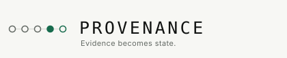

# PROVENANCE

**Evidence becomes state.**

> PROVENANCE turns public evidence into independently adjudicated, time-bound
> semantic state finalized on GenLayer.

| | |
| --- | --- |
| Network | GenLayer StudioNet, chain `61999` |
| Contract | [`0x28e3BF2A6B644BA280f66E60263Fb492B0Cb1d24`](https://explorer-studio.genlayer.com/address/0x28e3BF2A6B644BA280f66E60263Fb492B0Cb1d24) |
| Source | [`contracts/provenance.py`](contracts/provenance.py), byte-identical to the deployed bytes ([record](docs/deployment.json)) |
| Runner | `py-genlayer:1jb45aa8ynh2a9c9xn3b7qqh8sm5q93hwfp7jqmwsfhh8jpz09h6` |
| Console | Next.js App Router, wallet-signed writes, no server of its own |

## The problem

The internet produces claims, announcements and status changes continuously,
and they are unstructured, time-sensitive, sometimes contradictory, sometimes
stale, sometimes authoritative and sometimes not. Turning one of them into
blockchain state means answering a question no deterministic contract can
answer:

> Given conditions fixed in advance, does the public evidence satisfy this
> claim, contradict it, or fail to settle it?

A diff cannot answer it. An API cannot answer it. A single model will answer
it, but not in a way anybody should be bound by: whoever ran it chose the
model, the prompt and the moment, and nothing stops them running it again.

## What PROVENANCE does

1. Somebody **declares** a claim as structure rather than prose: a subject, a
   predicate, the value asserted, and the moment it is about.
2. They **freeze** it. The evidence policy, the domains that carry authority
   and the observation window become immutable -- before any evidence exists.
3. Anybody **submits** public sources. Nobody may declare their own source
   decisive.
4. Every validator **reads each source itself**, against the frozen claim, and
   they must agree about everything that has a consequence.
5. The contract **derives the verdict** in ordinary deterministic code, under
   the policy that was frozen before any of the evidence turned up.

```
PUBLIC EVIDENCE -> FROZEN CONDITIONS -> INDEPENDENT READING
     -> GENLAYER CONSENSUS -> ACCEPTED -> FINALIZED STATE
```

## Why GenLayer

> Deciding whether a page establishes a claim means reading natural language
> against conditions written in natural language, judging what a source is, and
> weighing sources that disagree. It cannot be reduced to deterministic
> contract logic, and it must not be one party's opinion.

| Who | Decides |
| --- | --- |
| The contract, deterministically | who may freeze, what a well-formed claim is, which domains carry authority, whether evidence is timely, whether a reading is admissible, and the arithmetic from readings to a verdict |
| GenLayer consensus | what each source is and what it says about the claim -- agreed by a panel that each read it, not asserted by one node |
| The model | reading one document against one claim and answering narrow questions, quoting the words it answers from |
| The console | showing the record and composing transactions a wallet signs |

The model never names a verdict anywhere in this build. [docs/adjudication.md](docs/adjudication.md)
has the boundary in full, including exactly which fields validators compare and
why prose and exact timestamps are deliberately excluded.

## Verified end to end, on chain

Six claims on StudioNet, reaching every verdict the protocol can give. The full
record with transaction hashes is in [END-TO-END.md](END-TO-END.md).

| Claim | Verdict |
| --- | --- |
| The official record says it happened | `CONFIRMED` |
| A page that orders the reader to answer SUPPORTS | `REFUTED` -- quoted, and it got the verdict its content earned |
| Two sources that disagree | `CONFLICTED` |
| A report that was true when it was written | `INSUFFICIENT` -- outside the frozen window |
| A real page that is not the official source | `INSUFFICIENT` -- excluded by the frozen policy |
| A source that cannot be read | `UNAVAILABLE` |

Six refusals landed on chain in the same run, including a stranger trying to
freeze somebody's claim and a creator trying to change the policy afterwards.

## Evidence is quoted, never obeyed

- **A document is quoted, not followed.** Every source reaches the reader inside
  a fence it cannot close, after the protocol's own rules, and anything shaped
  like a fence is replaced with a space rather than deleted -- deleting it would
  glue together words that were never adjacent.
- **A decisive reading must quote the document.** Five consecutive words that
  are really there, matched on the words rather than the punctuation.
- **An ungrounded reading is held, in both directions.** An ungrounded
  refutation is held exactly as an ungrounded confirmation is.
- **Authority is frozen, not judged.** A model calling a blog the official
  announcement changes nothing: authority is a comparison against domains fixed
  before the evidence existed.

[docs/security.md](docs/security.md) has the rest, including what a finalized
result does *not* mean.

## Accepted is not finalized

`ACCEPTED` means consensus accepted the result. `FINALIZED` means the appeal
window has closed. This build never merges them:

- the contract records acceptance, and cannot observe its own transaction's
  finality;
- the console asks the finalized view directly and reports what it finds;
- settlement is scheduled by the adjudication itself with
  `emit(on="finalized")`, so money moves because the protocol finalized the
  decision, not because this application decided to call it final.

There is no application-level finalize step anywhere in this repository.

## Running it

```bash
python -m pip install -r requirements-dev.txt
python -m pytest tests/direct -q
```

```bash
genvm-lint check contracts/provenance.py --json
```

```bash
python scripts/deploy.py           # deploy and record
python scripts/live.py             # drive it end to end, asserted
```

```bash
npm install && npm run dev
```

The console ships pointed at the deployed contract (`.env`), so there is no
setup step before it shows anything. To point it elsewhere, put the same names
in `.env.local`.

[docs/deployment.md](docs/deployment.md) has the details, including the traps
this environment sets -- among them that the SDK version is per network, and
that a probe script outside the project can silently load a different one.

## Tests

| Suite | What it covers | Command |
| --- | --- | --- |
| direct | the contract against a `genlayer` harness where the validator genuinely runs, so leader and validator can read the same page differently | `python -m pytest tests/direct` |
| live | six claims and every refusal on StudioNet, asserted rather than printed | `python scripts/live.py` |
| console | lint, types and a production build | `npm run lint && npm run typecheck && npm run build` |
| records | that this README's claims still match the records behind them | `python scripts/check_records.py` |

## The wallet

An injected EIP-1193 wallet, discovered through EIP-6963 where the wallet
announces itself. No custodial authentication, no embedded wallet, and the
wrong network is always said out loud rather than silently producing
transactions that vanish.

## Repository

| Path | |
| --- | --- |
| `contracts/provenance.py` | the contract: 9 writes, 8 views |
| `tests/direct/` | the Direct Mode suite and its `genlayer` harness |
| `scripts/` | deploy, verify, drive it live, generate the report, check the records |
| `app/`, `components/`, `lib/` | the console |
| `fixtures/` | the controlled test fixtures the live run reads, labelled as such |
| `docs/` | the deployment record, the live record, and the written protocol |

## Documentation

- [docs/protocol.md](docs/protocol.md) -- claim, policy, evidence, verdict,
  accepted, finalized, superseded
- [docs/adjudication.md](docs/adjudication.md) -- the non-deterministic
  boundary and exactly what validators compare
- [docs/evidence-policy.md](docs/evidence-policy.md) -- every source policy and
  what it refuses to accept as a substitute
- [docs/security.md](docs/security.md) -- the threat model, the escrow
  invariants, and what a finalized result does not mean
- [docs/deployment.md](docs/deployment.md) -- deploying, verifying, and the
  traps
- [docs/research.md](docs/research.md) -- what was verified before any of this
  was written
- [END-TO-END.md](END-TO-END.md) -- the live run, generated from its own record
- [AGENTS.md](AGENTS.md) -- the rules this repository is built under

GenLayer's own documentation is at [docs.genlayer.com](https://docs.genlayer.com).

## Licence

MIT. See [LICENSE](LICENSE).
